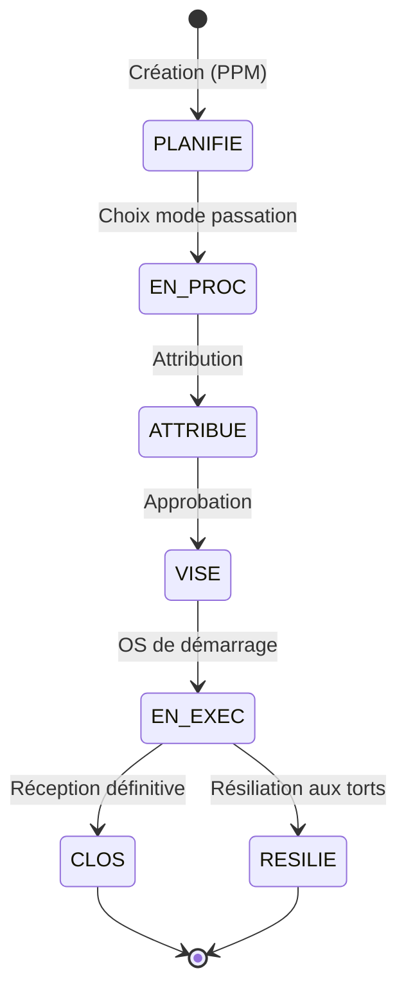
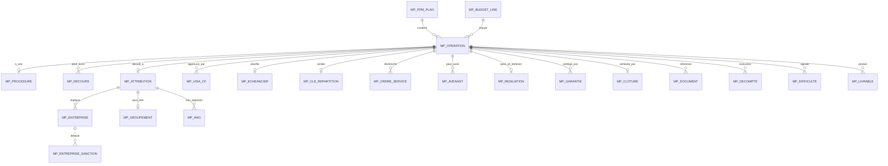

# Module Marché+ — Document de Conception (Synthèse exécutive)

> **Version** : 1.0 — Mai 2026
> **Périmètre** : Module « Marché+ » du portail SIDCF (clone évolutif du module Marché historique)
> **Public** : DSI, Direction du Contrôle Financier (DCF), équipes IT et fonctionnelles
> **Format** : parallèle Fonctionnel ⇄ Technique tout au long du document

---

## 0. Résumé exécutif

### 0.1 Contexte

Le **portail SIDCF** (Système Intégré de la Dépense et du Contrôle Financier) outille le suivi des marchés publics de Côte d'Ivoire pour la Direction du Contrôle Financier. Le module **Marché+** est un **clone évolutif** du module Marché historique, conçu pour expérimenter et itérer indépendamment sur de nouvelles fonctionnalités sans casser le module existant utilisé en exploitation.

### 0.2 Vocabulaire DCF (clarification essentielle)

À la DCF, le mot **« Opération »** désigne **un ensemble d'activités budgétaires** qui peut contenir un ou plusieurs marchés. Le terme prête donc à confusion dans le contexte technique où chaque ligne PPM = un seul marché. **Marché+ utilise désormais le terme « Marché et contrat »** dans toute l'UI, tandis que le code interne conserve les entités `MP_OPERATION`, `MP_ATTRIBUTION`, etc. (pour rétro-compatibilité technique).

| Vocabulaire DCF | Vocabulaire technique | Entité datastore |
|---|---|---|
| Marché / Contrat | Operation | `MP_OPERATION` |
| Imputation budgétaire | Ligne budgétaire | `MP_BUDGET_LINE` |
| Procédure → Contractualisation | Procedure | `MP_PROCEDURE` |
| Visa CF → **Approbation** | Visa CF | `MP_VISA_CF` (renommé en UI) |

### 0.3 Objectifs Marché+

| # | Objectif | Bénéfice |
|---|---|---|
| 1 | Permettre l'évolution du module Marché sans casser l'existant | Isolation totale (tables, routes, widgets, sidebar) |
| 2 | Intégrer les retours métier accumulés depuis 2024 | 38 modifications fonctionnelles à fin mai 2026 |
| 3 | Améliorer la transparence des calculs réglementaires | Badge 📐 cliquable exposant les formules sur chaque KPI |
| 4 | Gérer les cas complexes : multi-lot, multi-bailleur, groupement conjoint | Pattern `parLot[]` + clé de répartition + co-titulaires |
| 5 | Surveiller la santé du marché en temps réel | 5 niveaux (Normal / Surveiller / À risque / Bloqué / Non démarré) |

### 0.4 État au 15 mai 2026

- **15 marchés** dans la base de test (cycle complet : planification → clôture)
- **21 entités MP_*** + **5 référentiels métier**
- **15 écrans clonés** + **12 widgets MP** spécifiques
- **38 modifications** documentées, toutes déployées sur Vercel + Cloudflare + Neon
- **Module Marché historique masqué** (`moduleMarche: false`) — Marché+ est devenu le module de référence

---

## 1. Vue d'ensemble fonctionnelle

### 1.1 Cycle de vie d'un marché : les 5 phases

```
┌────────────────┐     ┌──────────────────┐     ┌────────────────┐
│ 📅 PLANIF.     │ ──▶ │ 📝 CONTRACT.     │ ──▶ │ ✅ ATTRIBUTION │
│   Inscription  │     │   Mode passation │     │   Attributaire │
│   au PPM       │     │   Soumissions    │     │   Montant      │
│                │     │   Choix          │     │   Garanties    │
└────────────────┘     └──────────────────┘     └───────┬────────┘
                                                        │
┌────────────────┐     ┌──────────────────┐     ┌───────▼────────┐
│ 🏁 CLÔTURE     │ ◀── │ ⚙️ EXÉCUTION     │ ◀── │ 🔍 APPROBATION │
│   Réceptions   │     │   OS & Mandats   │     │   Organe       │
│   Mainlevées   │     │   Avenants       │     │   Date         │
│   PV définitif │     │   Décomptes      │     │   Document     │
└────────────────┘     └──────────────────┘     └────────────────┘
```

**État métier ⇄ État stocké en base** :

| Phase | État `MP_OPERATION.etat` | Étape suivante autorisée |
|---|---|---|
| Planification | `PLANIFIE` | Contractualisation |
| Contractualisation | `EN_PROC` | Attribution |
| Attribution | `ATTRIBUE` | Approbation |
| Approbation | `VISE` | Exécution (uniquement si VISE) |
| Exécution | `EN_EXEC` | Clôture |
| Clôture | `CLOS` | (terminal) |
| Résiliation | `RESILIE` | (terminal alternatif) |

### 1.2 Acteurs et leurs rôles

| Acteur | Rôle métier | Périmètre d'action côté Marché+ |
|---|---|---|
| **DCF** (Direction du Contrôle Financier) | Saisit/suit les marchés, applique le contrôle financier | Tous les écrans en édition |
| **Contrôleur Financier (CF)** | Examine, formule réserves ou approbation | Section Approbation, Réserves CF |
| **DGMP** | Encadre les procédures de passation (COJO, validations) | Pilotage indirect via règles |
| **Attributaire** (entreprise) | Bénéficiaire du marché | Données saisies par DCF |
| **Bailleur** | Financeur (Trésor CI, BAD, BM, AFD, UE, BID, BOAD…) | Clé de répartition multi-bailleurs |
| **DSI** (équipe portail) | Maintient et fait évoluer le portail | Tous les écrans Admin + diagnostics |

### 1.3 Machine à états (transitions autorisées)



### 1.4 Vue fonctionnelle des écrans (15 écrans)

| Écran | Route | Phase | Rôle |
|---|---|---|---|
| Liste PPM | `/mp/ppm-list` | Toutes | KPIs santé + filtres + tableau |
| Import PPM | `/mp/ppm-import` | Planification | Import Excel |
| Création ligne PPM | `/mp/ppm-create-line` | Planification | Saisie manuelle |
| **Fiche de vie** | `/mp/fiche-marche` | Toutes | Vue 360° d'un marché |
| Procédure | `/mp/procedure` | Contractualisation | Mode + soumissionnaires + lots + PVs |
| Recours | `/mp/recours` | Contractualisation | Recours contestation |
| Attribution | `/mp/attribution` | Attribution | Attributaire + garanties + clé répartition |
| Échéancier | `/mp/echeancier` | Attribution | Calendrier paiements |
| **Approbation** | `/mp/visa-cf` | Approbation | Organe approbateur + date + doc |
| Exécution OS | `/mp/execution` | Exécution | OS + mandats |
| Avenants | `/mp/avenants` | Exécution | Liste + création |
| Création avenant | `/mp/avenant-create` | Exécution | Saisie nouvel avenant |
| Garanties | `/mp/garanties` | Exécution | Mainlevées |
| Clôture | `/mp/cloture` | Clôture | PV provisoire + définitif |
| Dashboard | `/mp/dashboard` | Toutes | KPIs globaux |

---

## 2. Architecture technique

### 2.1 Stack technique

```
┌─────────────────────────────────────────────────────────────┐
│  CLIENT (Navigateur)                                        │
│  ┌──────────────────────────────────────────────────────┐  │
│  │ Vanilla JavaScript (ES Modules)                      │  │
│  │ + CSS custom + Mermaid (rendus diagrammes)           │  │
│  │ Hash router (#/mp/...) — pas de bundler              │  │
│  └──────────────────────────────────────────────────────┘  │
└──────────────────────┬──────────────────────────────────────┘
                       │ HTTPS / fetch + REST JSON
                       ▼
┌─────────────────────────────────────────────────────────────┐
│  WORKER CLOUDFLARE                                          │
│  sidcf-portal-api.sidcf.workers.dev                         │
│  ┌──────────────────────────────────────────────────────┐  │
│  │ src/index.js — REST CRUD générique                   │  │
│  │ snakeToCamel / camelToSnake transparents             │  │
│  │ ENTITY_TABLE_MAP : MP_OPERATION → mp_operation       │  │
│  │ Upload R2 (préfixe mp/) + signed URLs                │  │
│  └──────────────────────────────────────────────────────┘  │
└─────────┬─────────────────────────────────────┬─────────────┘
          │ @neondatabase/serverless            │ S3 SDK
          ▼                                     ▼
┌──────────────────────┐              ┌──────────────────────┐
│  NEON POSTGRES       │              │  CLOUDFLARE R2       │
│  Database serverless │              │  Object storage      │
│  ┌────────────────┐  │              │  bucket "sidcf"      │
│  │ operation,     │  │              │  documents/          │
│  │ procedure,...  │  │              │  mp/                 │
│  │ mp_operation,  │  │              │   ├ avenants/        │
│  │ mp_procedure,  │  │              │   ├ approbation/     │
│  │ mp_visa_cf,... │  │              │   └ documents/       │
│  └────────────────┘  │              │                      │
└──────────────────────┘              └──────────────────────┘
```

### 2.2 Hébergement et déploiement

| Composant | Hébergement | Déclencheur de redéploiement |
|---|---|---|
| Frontend (statique) | **Vercel** (CDN global) | `git push origin main` → auto |
| Worker (API REST) | **Cloudflare Workers** | `wrangler deploy` manuel |
| Base de données | **Neon Postgres** (serverless) | Migrations SQL via `node run-any.js <fichier>` |
| Stockage fichiers | **Cloudflare R2** | Upload via Worker |

### 2.3 Stratégie d'isolation Marché ⇄ Marché+

L'**isolation stricte** entre les deux modules est le principe de conception qui permet à Marché+ d'évoluer sans risque pour Marché historique.

| Couche | Marché historique | Marché+ |
|---|---|---|
| Routes | `/ppm-list`, `/fiche-marche`, … | `/mp/ppm-list`, `/mp/fiche-marche`, … |
| Entités JS | `OPERATION`, `PROCEDURE`, … | `MP_OPERATION`, `MP_PROCEDURE`, … |
| Tables SQL | `operation`, `procedure`, … | `mp_operation`, `mp_procedure`, … |
| Bucket R2 | racine `documents/` | préfixe `mp/` |
| Widgets partagés | `steps.js`, `livrable-manager.js`, … | clones `steps-mp.js`, `livrable-manager-mp.js`, … |
| Référentiels | `registries.json` | `mp-banques.json`, `mp-regions-ci.json`, `mp-organes-approbation.json`, … |
| Feature flag | `moduleMarche` | `moduleMarchePlus` |

Aucun fichier `marche-plus/` n'importe un widget non-MP ; aucun fichier `marche/` n'importe un widget MP. Vérifié par audit.

### 2.4 Flux de données type — chargement d'une fiche marché

```
Utilisateur clique sur "Fiche de vie"
    │
    ▼
router.navigate('/mp/fiche-marche', { idOperation: '88...' })
    │
    ▼
renderFicheMarche(params)
    │
    ▼
dataService.getMpOperationFull(idOperation)
    │
    ├──▶ MP_OPERATION (1 record)
    ├──▶ MP_PROCEDURE (1)
    ├──▶ MP_ATTRIBUTION (1)
    ├──▶ MP_VISA_CF (N)
    ├──▶ MP_AVENANT (N)
    ├──▶ MP_GARANTIE (N)
    ├──▶ MP_DECOMPTE (N)
    └──▶ MP_DIFFICULTE (N)
    │
    ▼
Promise.all([...]) → Cloudflare Worker → Neon SQL
    │
    ▼
Worker : snake_case → camelCase (Date → ISO string)
    │
    ▼
Render des sections (Stepper, Identité, Attributaire, Approbation,
                     Exécution, Avenants, Garanties, Difficultés, …)
```

---

## 3. Modèle de données

### 3.1 ERD simplifié — 21 entités MP_*



### 3.2 Tableau parallèle Fonctionnel ⇄ Technique

| Concept métier | Entité | Table SQL | Cardinalité depuis MP_OPERATION |
|---|---|---|---|
| Inscription au PPM | `MP_PPM_PLAN` | `mp_ppm_plan` | parent (1..N) |
| Marché / Contrat | `MP_OPERATION` | `mp_operation` | racine |
| Imputation budgétaire | `MP_BUDGET_LINE` | `mp_budget_line` | parent (lookup) |
| Procédure de passation | `MP_PROCEDURE` | `mp_procedure` | 0..1 |
| Recours / contestation | `MP_RECOURS` | `mp_recours` | 0..N |
| Attribution + sous-traitance | `MP_ATTRIBUTION` | `mp_attribution` | 0..1 |
| Avis de Non-Objection | `MP_ANO` | `mp_ano` | 0..N |
| Échéancier de paiement | `MP_ECHEANCIER` | `mp_echeancier` | 0..1 |
| Clé de répartition bailleurs | `MP_CLE_REPARTITION` | `mp_cle_repartition` | 0..1 |
| Approbation (ex-Visa CF) | `MP_VISA_CF` | `mp_visa_cf` | 0..N |
| Ordre de service | `MP_ORDRE_SERVICE` | `mp_ordre_service` | 0..N |
| Avenant | `MP_AVENANT` | `mp_avenant` | 0..N |
| Résiliation | `MP_RESILIATION` | `mp_resiliation` | 0..1 |
| Garantie (avance, BE, retenue) | `MP_GARANTIE` | `mp_garantie` | 0..N |
| Clôture (PV prov + déf) | `MP_CLOTURE` | `mp_cloture` | 0..1 |
| Entreprise (référentiel) | `MP_ENTREPRISE` | `mp_entreprise` | catalogue |
| Groupement | `MP_GROUPEMENT` | `mp_groupement` | 0..1 |
| Document associé (R2) | `MP_DOCUMENT` | `mp_document` | 0..N |
| Décompte (OP/Mandat) | `MP_DECOMPTE` | `mp_decompte` | 0..N |
| Difficulté signalée | `MP_DIFFICULTE` | `mp_difficulte` | 0..N |
| Livrable | `MP_LIVRABLE` | (imbriqué JSONB) | 0..N |
| Entreprise sanctionnée | `MP_ENTREPRISE_SANCTION` | `mp_entreprise_sanction` | catalogue 8 entrées |

### 3.3 Patterns de stockage JSONB

Postgres stocke en colonne JSONB les structures imbriquées complexes pour éviter une explosion de tables.

| Pattern | Exemple | Avantage |
|---|---|---|
| **Multi-lot** : `parLot[lotId]` | `MP_ATTRIBUTION.parLot["LOT-A"] = {…}` | Mêmes champs différents par lot, pas de table pivot |
| **Co-titulaires** : `entreprises[]` | `attributaire.entreprises = [mandataire, cotit1, cotit2…]` | Liste variable, chaque entrée porte ses CB |
| **Coordonnées bancaires** : `coordonneesBancaires` | `{ banque, agence, numeroCompte, intituleCompte, swiftBic }` | Imbriqué dans chaque entreprise |
| **Localisation cascade CI** | `localisation = { region, regionCode, district, …, latitude, longitude }` | Pas de jointure pour afficher |
| **Sous-traitants** : `sousTraitants[]` | `[{ raisonSociale, ncc, pourcentageMarche, agrementCF, … }]` | Liste sans table |
| **Items échéancier** : `items[]` | `[{ num, datePrevisionnelle, montant, pourcentage, livrablesCibles[] }]` | Chronologie sans table |

### 3.4 Exemple : structure complète d'une `MP_OPERATION`

```javascript
{
  id: "88888888-8888-8888-8888-888888888888",
  exercice: 2025,
  objet: "Réparation urgente système climatisation bâtiment DGMP",
  unite: "Direction Générale des Marchés Publics",
  modePassation: "GRE",         // PSC / PSD / PSL / PSO / AOO / AOR / PI / GRE / ED
  typeMarche: "SERVICES",
  montantPrevisionnel: 23_600_000,
  montantActuel: 0,             // recalculé avec avenants
  etat: "EN_EXEC",
  typeFinancement: "ETAT",
  sourceFinancement: "TRESOR",
  budgetLineId: "uuid-de-l-imputation-budgetaire",
  chaineBudgetaire: {
    section: "...", sectionLib: "Ministère...",
    activite: "A0513", activiteLib: "Entretien bâtiments",
    natureCode: "232", nature: "Maintenance",
    bailleur: "TRESOR"
  },
  localisation: { region: "...", regionCode: "ABIDJAN", latitude: ..., longitude: ... },
  livrables: [
    { id, type: "EQUIPEMENT", libelle: "Climatiseurs", quantite: 12, localisation: {…} }
  ],
  // ... autres champs métier
  createdAt: "2025-...",
  updatedAt: "2026-..."
}
```

---

## 4. Référentiels métier

### 4.1 Vue d'ensemble (5 référentiels MP)

| Référentiel | Fichier | Volume | Source |
|---|---|---|---|
| Banques CI | `mp-banques.json` | 12 + AUTRE | APBEF-CI / BCEAO |
| Régions CI | `mp-regions-ci.json` | 31 régions + 2 districts autonomes | Décret 2011-263 |
| Organes approbateurs | `mp-organes-approbation.json` | 24 organes (admin centrale, déconcentré, collectivités, EPN, SODE, projets cofinancés) | Décret 2021-909 + Arrêté 728/MPMB/DGBF/DMP |
| Entreprises sanctionnées | `MP_ENTREPRISE_SANCTION` (DB) | 8 seed + ajouts manuels | DGMP + BM + AFD + INTERNE |
| Modes de passation | `registries.json → MODE_PASSATION` | 9 modes | Code des Marchés Publics CI |

### 4.2 Régions de Côte d'Ivoire

**Structure officielle** : 2 districts autonomes + 31 régions, regroupées en 12 districts.

| District | Régions (chef-lieu) |
|---|---|
| ★ District Autonome | **Abidjan** • **Yamoussoukro** |
| Lagunes | Agnéby-Tiassa (Agboville) · Grands-Ponts (Dabou) · La Mé (Adzopé) |
| Comoé | Sud-Comoé (Aboisso) · Indénié-Djuablin (Abengourou) |
| Lacs | Iffou (Daoukro) · Moronou (Bongouanou) · N'Zi (Dimbokro) · Bélier (Toumodi) |
| Vallée du Bandama | Gbêkê (Bouaké) · Hambol (Katiola) |
| Sassandra-Marahoué | Marahoué (Bouaflé) · Haut-Sassandra (Daloa) |
| Montagnes | Cavally (Guiglo) · Guémon (Duékoué) · Tonkpi (Man) |
| Bas-Sassandra | Gbôklé (Sassandra) · Nawa (Soubré) · San Pédro |
| Gôh-Djiboua | Gôh (Gagnoa) · Lôh-Djiboua (Divo) |
| Savanes | Bagoué (Boundiali) · Poro (Korhogo) · Tchologo (Ferkessédougou) |
| Woroba | Bafing (Touba) · Béré (Mankono) · Worodougou (Séguéla) |
| Zanzan | Bounkani (Bouna) · Gontougo (Bondoukou) |
| Denguélé | Folon (Minignan) · Kabadougou (Odienné) |

### 4.3 Organes approbateurs (matrice scope × seuil)

| Scope d'institution | Seuil applicable | Organe |
|---|---|---|
| **Transverse** (toutes) | — | Contrôleur Financier (CF), DGMP, DGBF |
| **Administration centrale** | 100M – < 300M | Ministre Technique |
| Administration centrale | 100M – < 300M (délégation) | Directeur de Cabinet du Min. Technique, SG du Min. Technique |
| Administration centrale | ≥ 300M | Ministre des Marchés Publics |
| Administration centrale | 300M – < 500M (délégation) | Directeur des Marchés Publics (DMP) |
| Administration centrale | 500M – < 1Md (délégation) | Directeur de Cabinet Adjoint MMP |
| Administration centrale | ≥ 1Md | Premier Ministre |
| Administration centrale | (exceptionnel) | Président de la République |
| **Déconcentré** | ≥ 100M | Préfet de Région, Préfet de Département |
| Déconcentré | < 100M (délégation) | Sous-Préfet |
| **Collectivité territoriale** | 30M – 100M | Organe exécutif CT |
| Collectivité territoriale | (toutes valeurs) | Maire, Président Conseil Régional, Président Conseil Départemental |
| **SODE / SPFME** | (toutes) | Conseil d'Administration, DG par délégation |
| **EPN** | (toutes) | PCA, DG par délégation |
| **Projet cofinancé** | ≤ 1Md | Coordonnateur du Projet, Directeur du Projet |
| Projet cofinancé | > 1Md | Ministre des Marchés Publics |
| Tous scopes | — | **AUTRE / Non listé** (saisie manuelle) |

### 4.4 Banques CI (12 + AUTRE)

```
BICICI      Banque Internationale pour le Commerce et l'Industrie de CI
SGCI        Société Générale Côte d'Ivoire
ECOBANK     Ecobank Côte d'Ivoire
NSIA        NSIA Banque Côte d'Ivoire
BACI        Banque Atlantique Côte d'Ivoire
BHCI        Banque de l'Habitat de Côte d'Ivoire
BSIC        Banque Sahélo-Saharienne pour l'Investissement et le Commerce
UBA         United Bank for Africa Côte d'Ivoire
BDU         BDU-CI — Banque de l'Union
VERSUS      Versus Bank
CORIS       Coris Bank International Côte d'Ivoire
BNI         Banque Nationale d'Investissement
AUTRE       Autre / Non listée (préciser dans agence)
```

### 4.5 Modes de passation (Code MP CI)

| Code | Libellé | Seuil indicatif |
|---|---|---|
| **PSC** | Procédure Simplifiée sur Consultation | 10M – 30M XOF (3 fournisseurs min, sélection plus avantageuse, DCF peut émettre réserves) |
| **PSD** | Procédure Simplifiée sur Demande de prix | < 10M |
| **PSL** | Procédure Simplifiée Légale | 30M – 100M |
| **PSO** | Procédure Spécialisée sur Offres | 100M – 500M |
| **AOO** | Appel d'Offres Ouvert | ≥ 100M (admin centrale) — règle générale |
| **AOR** | Appel d'Offres Restreint | Cas spécifiques, pré-qualification |
| **PI** | Procédure d'Ingénierie / Études | Études et prestations intellectuelles |
| **GRE** | Gré à gré / Entente directe | Cas exceptionnels avec dérogation justifiée |
| **DEM** | Demande d'Expression de Manifestation | Phase amont (manifestation d'intérêt) |
| **CI** | Concours d'Ingénierie | Conception, architecture |
| **ED** | Entente Directe | Urgence, monopole |

---

## 5. Règles de gestion clés (extraits)

> Cette section liste les **formules** et **comportements conditionnels** appliqués automatiquement par Marché+. Toutes sont exposées dans l'UI via un badge cliquable **📐** (modif #37).

### 5.1 Cumul des avenants — seuils RG021 du SDF

> **Référence** : RG021 Système de Suivi des Dépenses Financières + Code MP CI

| Formule | Niveau | Comportement UI |
|---|---|---|
| `Σ avenants.variationMontant / montantInitial × 100` | < 25% | OK (informatif) |
| idem | 25% – < 30% | ⚠️ **Alerte** : seuil d'alerte atteint, vigilance |
| idem | ≥ 30% | 🚫 **Seuil légal dépassé** : dérogation OBLIGATOIRE pour tout nouvel avenant |

**Implémentation** :
```javascript
// ecr04b-avenants.js — calcul en temps réel
const totalAvenants = avenants.reduce((sum, av) => sum + (av.variationMontant || 0), 0);
const pourcentageCumul = (totalAvenants / montantInitial) * 100;
if (pourcentageCumul >= 30) // alert blocante
else if (pourcentageCumul >= 25) // alert orange
```

### 5.2 Garanties — taux légaux (Code MP CI Art. 76 et suivants)

| Garantie | Plage légale | Application |
|---|---|---|
| Garantie d'avance | 10% – 15% du montant marché | Warning si hors plage |
| Garantie de bonne exécution | 5% – 10% | Warning si hors plage |
| Retenue de garantie | 10% (taux fixe) | Warning si ≠ 10% |
| Cautionnement | Selon CCAP | Pas de validation automatique |

**Affichage** : chaque garantie a un **badge 📐** "Plage légale 10% – 15%" en regard, et un bandeau de warning live sous le widget montant/% si le taux saisi sort de la plage.

### 5.3 Santé du marché (modif #36) — 5 niveaux

| État | Couleur | Formule |
|---|---|---|
| 🟢 **En progression normale** | Vert | `etat ∈ {EN_EXEC, EXECUTION, CLOS}` ET `cumul avenants < 25%` ET aucune difficulté CRITIQUE/ÉLEVÉE en cours |
| 🟡 **À surveiller** | Jaune | `cumul avenants ∈ [25%, 30%[` OU `≥1 difficulté impact ÉLEVÉ en cours` |
| 🔴 **À risque** | Rouge | `cumul avenants ≥ 30%` |
| ⛔ **Bloqué** | Rouge foncé | `≥1 difficulté impact CRITIQUE en cours` OU `etat == RESILIE` |
| ⚪ **Non démarré** | Gris | `etat ∉ {EN_EXEC, EXECUTION, RESILIE, CLOS}` |

**Calcul** : agrégation côté frontend sur `MP_OPERATION + MP_AVENANT + MP_DIFFICULTE` pour chaque ligne (tableau Liste PPM), chargement en parallèle avec `Promise.all`.

### 5.4 Détection des sanctions (modif #30) — algorithme

```javascript
async function checkSanction(entreprise, opts = { asOf: Date.now() }) {
  const all = await loadAll(); // cache 60s
  // Filtre 1 : sanctions ACTIVES à la date asOf
  //   active = dateDebut ≤ asOf ≤ dateFin (ou dateFin null)
  const pool = all.filter(s => isSanctionActive(s, opts.asOf));
  // Filtre 2 : match prioritaire
  //   (a) NCC exact      → match
  //   (b) RCCM exact     → match
  //   (c) Raison sociale normalisée (sans accents/ponctuation, length ≥ 4)
  return pool.find(matchByNCC) ||
         pool.find(matchByRCCM) ||
         pool.find(matchByNameNormalized);
}
```

**Étendu en modif #38** : `checkSanctionsGroupement()` scanne aussi tous les co-titulaires d'un groupement (vecteur d'attaque connu pour contourner une sanction).

### 5.5 Filtrage des organes approbateurs (modif #16)

```javascript
function getOrganesApplicables({ scope, montant }) {
  // scope = institution.type (ADMIN_CENTRALE / DECONCENTRE / SODE_SPFME / …)
  // 1. Match scope strict (ou scope = "*" pour transverse comme CF, DGMP)
  // 2. Match seuil : seuilMin ≤ montant ≤ seuilMax (null = pas de borne)
  // 3. Cas dégradé : si seul AUTRE matche le strict (montant hors plages),
  //    on relâche le filtre seuil pour proposer les autres organes du scope
}
```

### 5.6 Sous-traitance (modif #38.b)

| Cumul % marché en sous-traitance | Statut | Indication UI |
|---|---|---|
| ≤ 30% | ✅ OK | Vert |
| 30% – 40% | ⚠️ Surveiller | Jaune |
| > 40% | 🚫 Plafond dépassé | Rouge (référence Code MP CI Art. 130) |

---

## 6. Parcours par phase (vue condensée)

Tableau parallèle Fonctionnel ⇄ Technique pour les 6 phases principales.

### 6.1 Phase « Contractualisation »

| FONCTIONNEL | TECHNIQUE |
|---|---|
| **Objectif** : choisir le mode de passation et saisir les soumissionnaires | Écran : `ecr02a-procedure-pv.js` (route `/mp/procedure`) |
| **Règles** : mode proposé par la matrice institution × montant ; dérogation justifiée si non admissible | Helper : `rules-engine.getSuggestedProcedures(operation)` + champ `procDerogation` |
| **Multi-lot** : possible pour PSC+, AOO, PSO… | Widget `lots-procedure-mp.js` ; structure `procedure.lots[]` |
| **PVs** : ouverture, analyse technique, analyse financière, jugement | Upload R2 avec préfixe `mp/` |
| **Détection sanctions** sur le fournisseur retenu | `checkSanction()` debounce 300ms |
| **État résultant** | `MP_OPERATION.etat = 'EN_PROC'` |

### 6.2 Phase « Attribution »

| FONCTIONNEL | TECHNIQUE |
|---|---|
| **Objectif** : saisir l'attributaire, ses garanties, sa clé de répartition multi-bailleurs, son échéancier, ses sous-traitants | Écran : `ecr03a-attribution.js` (route `/mp/attribution`) |
| **Attributaire** : entreprise unique OU groupement (conjoint avec co-titulaires OU solidaire) | `attributaire.entreprises[]` avec roles MANDATAIRE / COTITULAIRE |
| **Coordonnées bancaires** : pour chaque entreprise (banque + agence + RIB + intitulé + SWIFT) | `coordonneesBancaires` nichée dans chaque entrée |
| **Garanties** : avance, bonne exécution, cautionnement (saisie XOF ou %) | Widget `montant-pourcentage-dual-input.js` + validation seuils légaux |
| **Clé de répartition** : N bailleurs avec part HT/TTC | `MP_CLE_REPARTITION.lignes[]` |
| **Échéancier** : items chronologiques (montant + livrables ciblés) | `MP_ECHEANCIER.items[]` |
| **Sous-traitance** : N sous-traitants avec % marché + agrément CF | `attributaire.sousTraitants[]` |
| **Détection sanctions** sur attributaire + mandataire + tous co-titulaires | `checkSanctionsGroupement()` |
| **État résultant** | `MP_OPERATION.etat = 'ATTRIBUE'` |

### 6.3 Phase « Approbation » (ex-Visa CF)

| FONCTIONNEL | TECHNIQUE |
|---|---|
| **Objectif** : enregistrer la décision d'approbation par l'organe compétent | Écran : `ecr03c-visa-cf.js` (route `/mp/visa-cf`) |
| **Organe approbateur** : sélection filtrée selon scope + montant | Helper `mp-organes-approbation.getOrganesApplicables()` |
| **Date d'approbation** + document justificatif (facultatif) | Upload R2 `mp/approbation/` |
| **Pas de réserves/refus** (simplification vs Marché historique) | Champ `decision = 'APPROUVE'` par défaut |
| **Modification possible** d'une approbation existante | `update(MP_VISA_CF, id, payload)` |
| **État résultant** | `MP_OPERATION.etat = 'VISE'` |

### 6.4 Phase « Exécution »

| FONCTIONNEL | TECHNIQUE |
|---|---|
| **Objectif** : suivre l'exécution physico-financière du marché | Écran : `ecr04a-execution-os.js` + `avenants.js` + `garanties.js` |
| **Ordres de service** : OS de démarrage, OS de service modifié | `MP_ORDRE_SERVICE` (count) |
| **Avenants** : variation montant ou délai, alerte 25% / blocage 30% | `MP_AVENANT[]` |
| **Décomptes / Mandats** : OP, mandats émis | `MP_DECOMPTE` |
| **Difficultés signalées** : impact (FAIBLE/MOYEN/ÉLEVÉ/CRITIQUE), statut | `MP_DIFFICULTE` + widget `difficultes-manager-mp.js` |
| **Santé recalculée** automatiquement à chaque modification | `computeSanteMarche(...)` |
| **Garanties** : suivi période active, gestion mainlevée | `MP_GARANTIE` |
| **État résultant** | `MP_OPERATION.etat = 'EN_EXEC'` |

### 6.5 Phase « Clôture »

| FONCTIONNEL | TECHNIQUE |
|---|---|
| **Objectif** : prononcer la réception et clore le dossier | Écran : `ecr05-cloture.js` (route `/mp/cloture`) |
| **Réception provisoire** : PV, date, réserves éventuelles | `MP_CLOTURE.receptionProvisoire` |
| **Réception définitive** : PV final | `MP_CLOTURE.receptionDefinitive` |
| **Mainlevées** des garanties | `MP_GARANTIE.etat = 'LIBEREE'` |
| **État résultant** | `MP_OPERATION.etat = 'CLOS'` |

---

## 7. Annexes condensées

### 7.1 Glossaire métier

| Sigle | Signification |
|---|---|
| **CCAP** | Cahier des Clauses Administratives Particulières |
| **CF** | Contrôleur Financier |
| **COJO** | Commission d'Ouverture et de Jugement des Offres |
| **COPE** | Commission d'Ouverture et d'évaluation des Plis et Offres |
| **DCF** | Direction du Contrôle Financier |
| **DGBF** | Directeur Général du Budget et des Finances |
| **DGMP** | Directeur Général des Marchés Publics |
| **EPN** | Établissement Public National |
| **NCC** | Numéro de Compte Contribuable |
| **OS** | Ordre de Service |
| **PPM** | Plan de Passation des Marchés |
| **PV** | Procès-Verbal |
| **RCCM** | Registre du Commerce et du Crédit Mobilier |
| **RG021** | Règle de Gestion #021 du Système de Suivi Financier (avenants 30%) |
| **SDF** | Système de Suivi des Dépenses Financières |
| **SODE** | Société d'État |
| **SPFME** | Société à Participation Financière Majoritaire de l'État |

### 7.2 Glossaire technique

| Terme | Signification |
|---|---|
| **Hash router** | Routage côté client basé sur `window.location.hash` (#/mp/...) — aucun rewrite serveur nécessaire |
| **ES Modules** | JavaScript natif moderne (`import / export`) — pas de bundler (Vite, Webpack…) |
| **JSONB** | Type Postgres permettant de stocker du JSON binaire indexable — utilisé pour les structures imbriquées (lots, co-titulaires, …) |
| **Worker Cloudflare** | Fonction serverless edge qui sert d'API REST entre frontend et Neon |
| **R2** | Service de stockage d'objets de Cloudflare (équivalent S3, sans frais de sortie) |
| **Hashing-by-prefix** | Pattern d'isolation Marché+ : préfixer routes (`/mp/`), entités (`MP_`), tables (`mp_`), bucket (`mp/`) |
| **Snake/camel auto-conversion** | Le Worker convertit transparente snake_case (Postgres) ↔ camelCase (JS) |

### 7.3 Liste des 38 modifications (chronologie)

| # | Titre | Impact principal |
|---|---|---|
| 1 | Activité dans la chaîne programmatique | Données |
| 2 | Recherche filtrable sur Activité | UI |
| 3 | Multi-financement par opération | Données + UI |
| 4 | Alignement MP_BUDGET_LINE sur ua-activites.json | Référentiel |
| 5 | « État » → « Étape » + retrait colonne Bailleur | UI |
| 6 | Bloc Livrables : édition inline + génération en lot | UI + Schema |
| 7 | TYPE_MARCHE en MAJUSCULES | Référentiel |
| 8 | TYPE_COMMISSION limité à COJO + COPE | Référentiel |
| 9 | Procédure-PV : multi-PV (tech / fin / combiné) | UI + Schema |
| 10 | Attribution : retrait « Motif détaillé » | UI |
| 11 | Rules engine : matching natureCode | Backend |
| 12 | Multi-lot dans la Contractualisation | Schema + UI |
| 13 | Sélecteur de lot pour 7 phases aval | UI |
| 14 | Vérification libellé « Multi-Bailleurs » | — |
| 15 | `moduleMarche: false` (masquage) | Config |
| 16 | Référentiel organes enrichi (24 entrées) | Référentiel |
| 17 | Approbation : upload R2 + flow update | UI + R2 |
| 18 | Coordonnées bancaires + garanties par taux | UI + Schema |
| 19 | Livrables : quantité d'exemplaires | UI + Schema |
| 20 | Co-titulaires (groupement conjoint) | UI + Schema |
| 21 | Widget DUAL montant/% (bidirectionnel) | UI |
| 22 | Libellés Montant selon la phase | UI |
| 23 | ecr04c-garanties migré DUAL | UI |
| 24 | Widget multi-select-collapsible-mp | UI |
| 25 | Mises à jour référentielles + Fiche Marché | Référentiel + UI |
| 26 | Fiche de Vie consolidée | UI |
| 27 | Widget budget-line-history-mp réutilisable | UI |
| 28 | Widget related-operations-mp | UI |
| 29 | Widget difficultes-manager-mp | UI + Schema |
| 30 | mp-sanctions enrichi (période + groupement) | Backend + UI |
| 31 | Widget document-upload-mp | UI + R2 |
| 32 | Restauration boutons suivi processus | UI |
| 33 | Widget DUAL : saisie bidirectionnelle garantie | UI |
| 34 | Section « Situation d'exécution financière » | UI |
| 35 | Encart pluriannualité dans la fiche | UI |
| 36 | Tuiles santé agrégées (5 niveaux) | UI + formule |
| 37 | Composant formula-tip-mp (transparence 📐) | UI |
| 38 | Imputation budgétaire (renommage) + module sous-traitance | UI + Schema |

### 7.4 Endroits où trouver l'information vivante

| Besoin | Où chercher |
|---|---|
| Schéma exact d'une entité MP_* | `sidcf-portal/js/datastore/schema.js` |
| Logique de filtrage des organes | `sidcf-portal/js/lib/mp-organes-approbation.js` |
| Algorithme de détection sanctions | `sidcf-portal/js/lib/mp-sanctions.js` |
| Calcul de la santé du marché | `sidcf-portal/js/modules/marche-plus/screens/ecr01b-ppm-unitaire.js` (fonction `computeSanteMarche`) |
| Règles taux garanties | `sidcf-portal/js/lib/mp-garanties-rules.js` + `sidcf-portal/js/config/rules-config.json` |
| Mapping entités ↔ tables SQL | `postgres/worker/src/index.js` (`ENTITY_TABLE_MAP`) |
| Migrations SQL | `postgres/migrations/*.sql` |
| Chronologie complète | `MARCHE_PLUS_CHANGELOG.md` |
| Recettes opérationnelles | `MODULES.md` |

---

*Document généré le 15 mai 2026. Pour une version exhaustive (50+ pages, sections 6 et 7 développées + annexes complètes), demander l'option A.*
